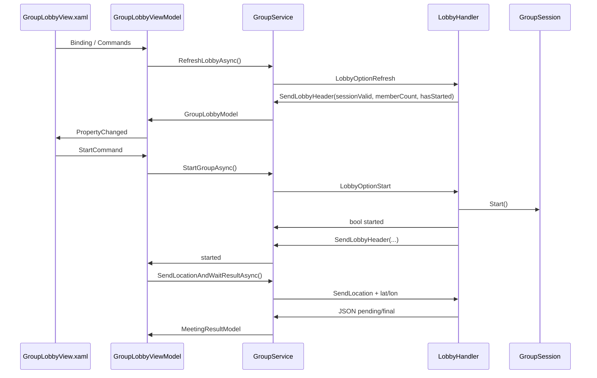
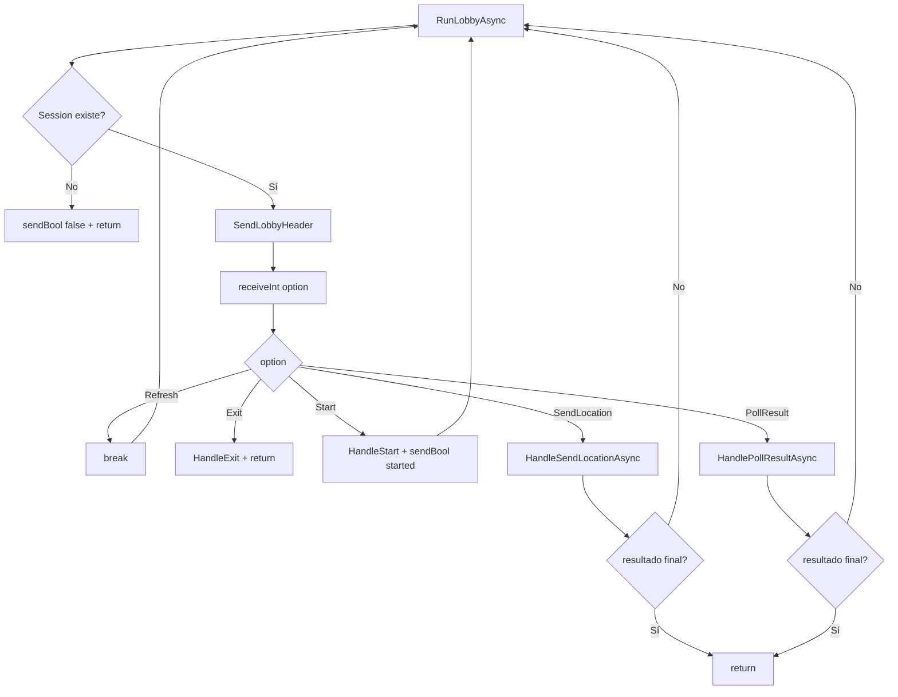

# Lobby Flow & Socket Protocol — Just Meeting Point

## 1. Resumen ejecutivo

El lobby de **Just Meeting Point** permite que varios usuarios entren en una sesión de grupo, esperen a que el host inicie el cálculo, envíen su ubicación y reciban un resultado de ruta hacia un punto de encuentro.

El flujo se reparte entre varias capas:

```text
GroupLobbyView.xaml
        ↓ Binding / Commands
GroupLobbyViewModel
        ↓ IGroupService
GroupService
        ↓ SocketTools
Servidor TCP / LobbyHandler
        ↓ GroupSession / MeetingRouteService
Resultado JSON
```

La idea central del protocolo es:

```text
Servidor envía cabecera del estado actual
Cliente lee cabecera
Cliente envía opción
Servidor procesa opción
Servidor vuelve al bucle
```

---

## 2. Archivos implicados

| Archivo | Capa | Responsabilidad |
|---|---|---|
| `GroupLobbyView.xaml` | UI | Define labels, botones, progress bar y bindings |
| `GroupLobbyView.xaml.cs` | Code-behind | Asigna `BindingContext` y controla `OnAppearing` / `OnDisappearing` |
| `GroupLobbyViewModel.cs` | ViewModel | Orquesta estado del lobby, polling, comandos, GPS y navegación |
| `IGroupService.cs` | Contrato | Define operaciones disponibles para el ViewModel |
| `GroupService.cs` | Cliente / Servicio | Encapsula socket, protocolo, validaciones, cabeceras y JSON |
| `SocketTools` / `NetUtils` | Infraestructura de red | Envía y recibe tipos básicos por socket |
| `LobbyHandler.cs` | Servidor | Mantiene el bucle del lobby y procesa opciones |
| `GroupSession.cs` | Dominio / Estado | Guarda miembros, owner, ubicaciones y estado `HasStarted` |
| `IMeetingRouteService` | Aplicación | Calcula ruta final para cada usuario |

---

## 3. Responsabilidad de cada capa

### 3.1 `GroupLobbyView.xaml`

La vista no contiene lógica de negocio. Solo declara qué se muestra y qué comandos se ejecutan.

Ejemplos:

```xml
<Label Text="{Binding CurrentStatus}" />
<ProgressBar Progress="{Binding ProgressValue}" />

<Button
    Text="Iniciar grupo"
    Command="{Binding StartCommand}"
    IsVisible="{Binding CanStartGroup}" />
```

La vista depende del `BindingContext`. En este caso, el `BindingContext` es `GroupLobbyViewModel`.

---

### 3.2 `GroupLobbyView.xaml.cs`

El code-behind debe ser mínimo.

Responsabilidades aceptables:

```text
InitializeComponent()
BindingContext = ViewModel
OnAppearing → StartAutoRefreshLoop()
OnDisappearing → StopAutoRefreshLoop()
```

Código relevante:

```csharp
public GroupLobbyView(GroupLobbyViewModel viewModel)
{
    InitializeComponent();
    _viewModel = viewModel;
    BindingContext = _viewModel;
}

protected override void OnAppearing()
{
    base.OnAppearing();
    _viewModel.StartAutoRefreshLoop();
}

protected override void OnDisappearing()
{
    _viewModel.StopAutoRefreshLoop();
    base.OnDisappearing();
}
```

Este archivo no debería leer sockets, calcular rutas ni decidir lógica de negocio.

---

### 3.3 `GroupLobbyViewModel.cs`

El ViewModel controla el flujo de pantalla:

```text
recibe GroupCode
refresca lobby
actualiza MemberCount / HasStarted
gestiona Start / Leave
pide permisos GPS
obtiene ubicación
envía ubicación
guarda resultado
navega al mapa
```

Ejemplos de responsabilidades:

```csharp
LoadLobbyAsync()
StartAsync()
LeaveGroupAsync()
RunAutoRefreshLoopAsync()
SendCurrentLocationAndNavigateToMapAsync()
```

---

### 3.4 `GroupService.cs`

El `GroupService` traduce operaciones de alto nivel a mensajes de socket.

Ejemplo conceptual:

```text
RefreshLobbyAsync()
↓
sendInt(LobbyOptionRefresh)
↓
ReadLobbyHeader()
↓
return GroupLobbyModel
```

El `ViewModel` no sabe cómo se envía un `int`, cómo se recibe un `bool` o cómo se parsea un JSON. Eso está encapsulado en el servicio.

---

### 3.5 `LobbyHandler.cs`

El servidor mantiene el bucle real del lobby:

```text
while true:
    enviar cabecera
    recibir opción
    procesar opción
```

Código clave:

```csharp
while (true)
{
    GroupSession? session = _sessionManager.Get(groupCode);

    if (session is null)
    {
        SocketTools.sendBool(socket, false);
        return;
    }

    SendLobbyHeader(socket, session);

    int option = SocketTools.receiveInt(socket);

    switch (option)
    {
        ...
    }
}
```

---

## 4. Flujo global del lobby

```text
Usuario entra al lobby
↓
Shell pasa groupCode e isCurrentUserHost
↓
ViewModel carga lobby inicial
↓
View aparece
↓
OnAppearing arranca auto-refresh
↓
Servidor manda cabecera
↓
Cliente manda Refresh periódicamente
↓
Host pulsa Start
↓
Servidor cambia HasStarted
↓
Clientes detectan HasStarted = true
↓
Cada cliente envía ubicación
↓
Servidor espera todas las ubicaciones
↓
Servidor calcula resultado individual
↓
Cliente navega al mapa
```

---

## 5. Protocolo cliente-servidor

### 5.1 Principio fundamental

El protocolo del lobby funciona por iteraciones.

En cada iteración:

```text
SERVIDOR → CLIENTE
cabecera estándar:
    bool sessionValid
    int memberCount
    bool hasStarted

CLIENTE → SERVIDOR
opción:
    int option
```

El servidor marca el ritmo de cada vuelta enviando primero la cabecera. El cliente la consume y responde con una opción.

---

## 6. Cabecera estándar del lobby

La cabecera contiene el estado actual de la sesión:

| Campo | Tipo | Significado |
|---|---|---|
| `sessionValid` | `bool` | Indica si la sesión sigue existiendo |
| `memberCount` | `int` | Número actual de miembros |
| `hasStarted` | `bool` | Indica si el grupo ya fue iniciado por el host |

### Servidor

```csharp
private static void SendLobbyHeader(Socket socket, GroupSession session)
{
    SocketTools.sendBool(socket, true);
    SocketTools.sendInt(socket, session.MemberCount);
    SocketTools.sendBool(socket, session.HasStarted);
}
```

### Cliente

```csharp
private static LobbyHeader ReadLobbyHeader(Socket socket, string invalidSessionMessage)
{
    bool sessionValid = SocketTools.receiveBool(socket);

    if (!sessionValid)
        throw new InvalidOperationException(invalidSessionMessage);

    int memberCount = SocketTools.receiveInt(socket);
    bool hasStarted = SocketTools.receiveBool(socket);

    return new LobbyHeader(sessionValid, memberCount, hasStarted);
}
```

### Regla crítica

El orden de lectura debe coincidir exactamente con el orden de escritura:

| Servidor manda | Cliente lee |
|---|---|
| `sendBool(true)` | `receiveBool()` |
| `sendInt(memberCount)` | `receiveInt()` |
| `sendBool(hasStarted)` | `receiveBool()` |

Si una parte no lee algo en el orden correcto, el protocolo queda desincronizado.

---

## 7. Opciones del lobby

| Opción | Valor | Cliente envía | Servidor hace | Respuesta extra |
|---|---:|---|---|---|
| `Refresh` | `1` | `sendInt(1)` | No cambia estado, vuelve al bucle | Ninguna |
| `Exit` | `2` | `sendInt(2)` | Elimina al usuario de la sesión | Ninguna |
| `Start` | `3` | `sendInt(3)` | Inicia grupo si usuario es owner | `bool started` |
| `SendLocation` | `4` | `sendInt(4) + lat + lon` | Registra ubicación | JSON pending/final/error |
| `PollResult` | `5` | `sendInt(5)` | Consulta si ya hay resultado | JSON pending/final/error |

---

## 8. Flujos detallados

### 8.1 Crear grupo

Cliente:

```text
sendInt(MainGroupCreateGroup)
sendString(name)
sendString(category)
sendString(description)
sendString(method)
```

Servidor:

```text
crea grupo en DB
crea GroupSession en memoria
añade owner
```

Servidor responde:

```text
bool success
string groupCode
cabecera estándar
```

Cliente:

```csharp
bool success = SocketTools.receiveBool(socket);

if (!success)
    throw new InvalidOperationException("No se pudo crear el grupo.");

string groupCode = SocketTools.receiveString(socket);
LobbyHeader header = ReadLobbyHeader(socket, "La sesión de lobby no es válida.");
```

Modelo devuelto:

```csharp
return new GroupLobbyModel
{
    GroupCode = groupCode,
    MemberCount = header.MemberCount,
    HasStarted = header.HasStarted,
    IsCurrentUserHost = true
};
```

---

### 8.2 Unirse a grupo

Cliente:

```text
sendInt(MainGroupJoinGroup)
sendString(groupCode)
```

Servidor:

```text
normaliza código
valida sesión
añade usuario si es posible
```

Servidor responde:

```text
bool success
cabecera estándar
```

Cliente:

```csharp
bool success = SocketTools.receiveBool(socket);

if (!success)
    throw new InvalidOperationException("No se pudo unir al grupo.");

LobbyHeader header = ReadLobbyHeader(socket, "La sesión de lobby no es válida.");
```

---

### 8.3 Refrescar lobby

Flujo conceptual:

```text
Servidor manda cabecera N
Cliente lee cabecera N
Cliente envía Refresh
Servidor procesa Refresh
Servidor vuelve al while
Servidor manda cabecera N+1
```

Servidor:

```csharp
case (int)LobbyOpt.Refresh:
    AppLogger.Debug(
        "LobbyHandler",
        $"[Group:{groupCode}] Refresh. Members={session.MemberCount}, Started={session.HasStarted}");
    break;
```

Cliente:

```csharp
SocketTools.sendInt(socket, LobbyOptionRefresh);

LobbyHeader header = ReadLobbyHeader(socket, "La sesión del grupo ya no existe.");
```

Nota técnica:

El cliente funciona consumiendo la cabecera disponible y provocando la siguiente vuelta del bucle mediante `Refresh`. Por eso es fundamental que el estado enviado por el servidor se lea siempre en orden.

---

### 8.4 Host inicia grupo

Flujo:

```text
Servidor manda cabecera actual
Cliente host envía Start
Servidor valida que user.id == OwnerUserId
Servidor ejecuta session.Start()
Servidor responde bool started
Servidor vuelve al while
Servidor manda nueva cabecera con hasStarted = true
```

Servidor:

```csharp
private static void HandleStart(Socket socket, string groupCode, GroupSession session, User user)
{
    if (user.id != session.OwnerUserId)
    {
        SocketTools.sendBool(socket, false);
        return;
    }

    bool started = session.Start();
    SocketTools.sendBool(socket, started);
}
```

Cliente:

```csharp
SocketTools.sendInt(socket, LobbyOptionStart);

bool started = SocketTools.receiveBool(socket);

LobbyHeader header = ReadLobbyHeader(socket, "La sesión de lobby es inválida tras el Start.");
```

En el `ViewModel`:

```csharp
bool started = await _groupService.StartGroupAsync(GroupCode, IsCurrentUserHost);

if (!started)
{
    ErrorMessage = "No se pudo iniciar el grupo.";
    return;
}

HasStarted = true;
_hasSentLocation = true;
StopAutoRefreshLoop();

await SendCurrentLocationAndNavigateToMapAsync();
```

---

### 8.5 Participante detecta inicio

El participante no pulsa `Start`.

Detecta el inicio mediante el auto-refresh:

```text
Auto-refresh del participante
↓
LoadLobbyAsync
↓
RefreshLobbyAsync
↓
ReadLobbyHeader devuelve HasStarted = true
↓
ViewModel:
    _hasSentLocation = true
    StopAutoRefreshLoop()
    SendCurrentLocationAndNavigateToMapAsync()
```

Código relevante:

```csharp
if (!_hasSentLocation)
{
    _hasSentLocation = true;
    StopAutoRefreshLoop();

    UpdateCalculatingState("Obteniendo tu ubicación actual...", 0.45);

    await SendCurrentLocationAndNavigateToMapAsync();
}
```

---

### 8.6 Envío de ubicación

Cliente:

```text
sendInt(LobbyOptionSendLocation)
sendDouble(latitude)
sendDouble(longitude)
```

Cliente:

```csharp
SocketTools.sendInt(socket, LobbyOptionSendLocation);
SocketTools.sendDouble(socket, latitude);
SocketTools.sendDouble(socket, longitude);

return ReceiveMeetingResultJson(socket);
```

Servidor:

```text
recibe lat/lon
registra ubicación en GroupSession
si faltan ubicaciones:
    responde JSON pending
si están todas:
    calcula ruta
    responde JSON final
```

Servidor:

```csharp
if (!locationResult.AllLocationsReceived)
{
    SendPayload(socket, MeetingResultFactory.Pending());
    return false;
}

await SendRouteResultAsync(socket, session, user);
return true;
```

---

### 8.7 Polling del resultado

Si el servidor responde `DurationSeconds == -1`, el cliente interpreta que el resultado está pendiente.

Cliente:

```text
espera 1.5s
lee cabecera estándar
envía PollResult
recibe JSON
si DurationSeconds == -1, repite
```

Código:

```csharp
for (int attempt = 1; attempt <= MaxPollAttempts; attempt++)
{
    await Task.Delay(PollDelayMilliseconds);

    LobbyHeader header = ReadLobbyHeader(socket, "La sesión del grupo ha finalizado.");

    SocketTools.sendInt(socket, LobbyOptionPollResult);

    MeetingResultModel? result = ReceiveMeetingResultJson(socket);

    if (result is null)
        continue;

    if (result.DurationSeconds == -1)
        continue;

    return NormalizeResult(result, latitude, longitude);
}
```

Servidor:

```csharp
if (!session.AreAllLocationsReceived())
{
    SendPayload(socket, MeetingResultFactory.Pending());
    return false;
}

await SendRouteResultAsync(socket, session, user);
return true;
```

---

### 8.8 Salida del grupo

Cliente:

```text
sendInt(LobbyOptionExit)
```

Servidor:

```text
RemoveMember(user.id)
si MemberCount == 0:
    eliminar sesión
terminar RunLobbyAsync para ese usuario
```

Código servidor:

```csharp
private void HandleExit(string groupCode, GroupSession session, User user)
{
    session.RemoveMember(user.id);

    if (session.MemberCount == 0)
    {
        _sessionManager.Remove(groupCode);
    }
}
```

---

## 9. Sincronización del socket

El cliente mantiene un único socket autenticado.

Por tanto, `GroupService` usa:

```csharp
private readonly SemaphoreSlim _socketLock = new(1, 1);
```

Patrón:

```csharp
await _socketLock.WaitAsync();

try
{
    // send/receive por socket
}
finally
{
    _socketLock.Release();
}
```

### Motivo

Un socket TCP compartido no puede ser usado de forma concurrente por varias operaciones.

Riesgo sin lock:

```text
RefreshLobbyAsync envía Refresh
StartGroupAsync envía Start
Refresh lee bool started por error
Start lee cabecera por error
protocolo desincronizado
```

`SemaphoreSlim` evita que dos métodos del cliente hagan `send/receive` al mismo tiempo sobre el mismo socket.

---

## 10. Estados especiales del resultado

El servidor puede devolver distintos estados en `MeetingResultModel`.

| Valor | Significado |
|---:|---|
| `DurationSeconds == -1` | Resultado pendiente |
| `DurationSeconds == -2` | Error funcional |
| `DurationSeconds >= 0` | Resultado final |

Cliente:

```csharp
if (result.DurationSeconds == -2)
    throw new InvalidOperationException(result.AddressText);

if (result.DurationSeconds == -1)
    continue;
```

---

## 11. Manejo de errores

### 11.1 Sesión inválida

Servidor:

```text
sendBool(false)
```

Cliente:

```csharp
if (!sessionValid)
    throw new InvalidOperationException(invalidSessionMessage);
```

---

### 11.2 Permiso de ubicación denegado

Cliente:

```csharp
if (permission != PermissionStatus.Granted)
    throw new InvalidOperationException("Permiso de ubicación denegado.");
```

---

### 11.3 Timeout de resultado

Cliente:

```csharp
throw new TimeoutException("El cálculo está tardando demasiado. Inténtalo de nuevo.");
```

---

### 11.4 JSON inválido

Cliente:

```csharp
catch (JsonException ex)
{
    throw new InvalidOperationException(
        $"El servidor devolvió un resultado de ruta inválido: {json}", ex);
}
```

---

## 12. Decisiones de diseño

### 12.1 MVVM

Se usa MVVM para evitar que el `.xaml.cs` concentre lógica de negocio.

```text
XAML: pinta
ViewModel: orquesta
GroupService: comunica
Servidor: procesa
```

Ventaja:

```text
la UI no sabe de sockets
el ViewModel no sabe de bytes
el servicio no sabe de botones
el servidor no sabe de XAML
```

---

### 12.2 Cabecera estándar

El servidor manda una cabecera al inicio de cada vuelta para mantener sincronizados a los clientes:

```text
sessionValid
memberCount
hasStarted
```

---

### 12.3 Polling

El polling permite que los participantes esperen hasta que todas las ubicaciones estén disponibles.

---

### 12.4 `SemaphoreSlim`

Evita operaciones concurrentes sobre el mismo socket.

---

### 12.5 `_hasSentLocation`

Evita que el auto-refresh dispare dos veces el flujo final.

---

### 12.6 `CancellationTokenSource`

Permite cancelar el auto-refresh cuando la pantalla desaparece, el usuario sale o empieza el flujo final.

---

## 13. Riesgos conocidos

| Riesgo | Causa | Mitigación |
|---|---|---|
| Protocolo desincronizado | Leer datos en orden incorrecto | Documentar contrato send/receive |
| Doble envío de ubicación | Auto-refresh entra varias veces | `_hasSentLocation` |
| Socket pisado | Operaciones concurrentes | `SemaphoreSlim` |
| UI congelada | Receive bloqueante en hilo UI | `Task.Run` + `await` |
| Lobby activo tras navegar | No detener polling | `StopAutoRefreshLoop()` |
| Resultado nunca llega | Falta ubicación o fallo OTP | Timeout de polling |
| Cabecera pendiente sin leer | El servidor manda cabecera cada vuelta | Consumir siempre `ReadLobbyHeader()` |
| Error por permisos GPS | Usuario deniega ubicación | Mostrar error claro en `ErrorMessage` |

---

## 14. Checklist de depuración

### Si no actualiza participantes

- Revisar `OnAppearing()`.
- Revisar `StartAutoRefreshLoop()`.
- Revisar `RunAutoRefreshLoopAsync()`.
- Revisar `LoadLobbyAsync()`.
- Revisar `RefreshLobbyAsync()`.
- Revisar si `ReadLobbyHeader()` recibe `memberCount` correcto.
- Revisar servidor: `SendLobbyHeader()`.

---

### Si el botón iniciar no aparece

- Revisar `IsCurrentUserHost`.
- Revisar `IsCurrentUserHostRaw`.
- Revisar `CanStartGroup`.
- Revisar `HasStarted`.
- Revisar binding: `IsVisible="{Binding CanStartGroup}"`.

---

### Si el participante no pasa al cálculo

- Revisar si el servidor envía `hasStarted = true`.
- Revisar `ReadLobbyHeader()`.
- Revisar asignación: `HasStarted = lobby.HasStarted`.
- Revisar `OnHasStartedChanged()`.
- Revisar `_hasSentLocation`.

---

### Si se queda esperando resultado

- Revisar si todos los clientes enviaron ubicación.
- Revisar `DurationSeconds == -1`.
- Revisar `PollForResultInternalAsync()`.
- Revisar logs de `HandlePollResultAsync`.
- Revisar OTP/Docker.
- Revisar timeout de `MaxPollAttempts`.

---

### Si el socket se desincroniza

- Revisar orden exacto `send/receive`.
- Revisar si una cabecera queda sin consumir.
- Revisar si falta `SemaphoreSlim`.
- Revisar si se envió ubicación más de una vez.
- Revisar si `Exit` espera o no respuesta en el servidor.
- Revisar que cada opción del cliente coincida con el `switch` del servidor.

---

## 15. Glosario

| Término | Definición |
|---|---|
| Binding | Conexión entre XAML y ViewModel |
| ObservableProperty | Propiedad que notifica cambios a la UI |
| RelayCommand | Método expuesto como comando para XAML |
| Code-behind | Archivo `.xaml.cs` asociado a una vista |
| ViewModel | Clase que contiene estado y acciones de pantalla |
| Service | Clase que encapsula comunicación o lógica externa |
| Socket | Canal TCP persistente cliente-servidor |
| Protocolo | Orden pactado de mensajes entre cliente y servidor |
| Cabecera | Bloque `sessionValid/memberCount/hasStarted` |
| Polling | Consulta repetida cada cierto tiempo |
| SemaphoreSlim | Mecanismo para limitar acceso concurrente |
| CancellationToken | Señal para cancelar una tarea |
| DTO / Model | Objeto usado para transportar datos |
| JSON | Formato de texto usado para transportar el resultado de ruta |
| Task | Representación de una operación asíncrona |
| await | Espera una `Task` sin bloquear la UI |
| Task.Run | Ejecuta trabajo bloqueante en un hilo del ThreadPool |
| MainThread | Hilo principal donde deben hacerse operaciones de UI |

---

## 16. Diagramas Mermaid

### 16.1 Secuencia general



---

### 16.2 Bucle del servidor



---

## 17. Resumen final

El lobby funciona como un protocolo por turnos:

```text
1. El servidor envía una cabecera con el estado actual.
2. El cliente lee esa cabecera.
3. El cliente envía una opción.
4. El servidor procesa esa opción.
5. Si el flujo no termina, el servidor vuelve al inicio y envía otra cabecera.
```

La separación de capas es esencial:

```text
XAML
    solo presenta

Code-behind
    conecta lifecycle

ViewModel
    orquesta flujo de pantalla

GroupService
    encapsula socket y protocolo

LobbyHandler
    procesa opciones del servidor

GroupSession
    mantiene estado del grupo
```

El punto más delicado es el orden exacto de `send/receive`. Cualquier cabecera no consumida o cualquier lectura fuera de orden puede desincronizar el socket.
